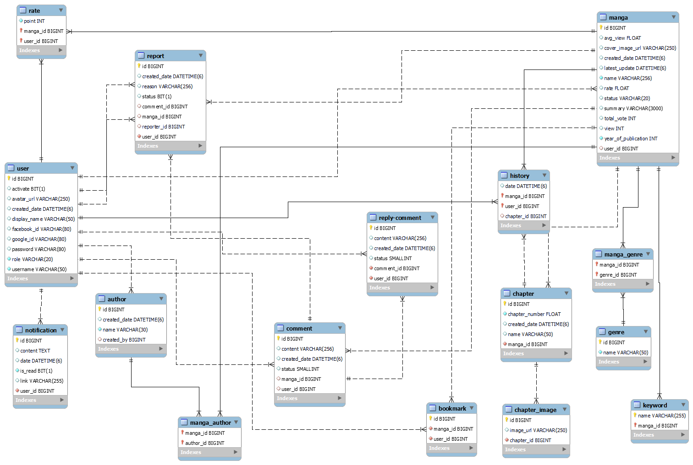

# Read manga online website

# Swagger local host URL: 
http://localhost:8080/swagger-ui/index.html#/

# Function list:

- Register by Email, facebook or username and password
- Reset password
- Update profile (display name, avatar, password)
- Manage user (change role, activate, deactivate)
- Notification
- Search mangas by name, genre, author, translator, keyword
- Sort mangas by views (day, week, month,...)
- Suggest manga
- Register for translator account
- Rate manga
- Report manga, user, translator
- Add manga to favorite (bookmark)
- View reading history, comment history
- Comment, reply comment

# Database:

# Framework

- Spring boot, Spring security, Spring dataJPA
- Hibernate
- JUnit 5, Mockito

# Environment

- IDE: Intellij
- Maven
- jdk 17
- Database: MySQL
- Cloud: AWS

# How to run project:
### Set up environment:
- Install MySQL
- Install jdk 17 or later
